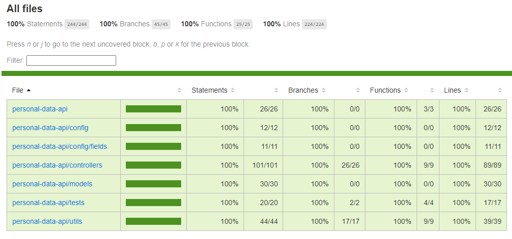

# Personal data API

This API allows users to make GET requests to retrieve personal data, as well as allowing the owner to create, update, and delete data through POST, PUT, and DELETE requests, respectively.

## Table of Contents

- [Endpoints](#endpoints)
  - [Parameters](#parameters)
  - [Response](#response)
- [Tests](#tests)
- [Dependencies](#dependencies)
- [Installation](#installation)
- [Scripts](#scripts)
- [Examples](#examples)
  - [GET request](#get-request)
  - [POST request](#post-request)
  - [PUT request](#put-request)
  - [DELETE request](#delete-request)
- [License](#license)

## Endpoints

The API has the following dynamic endpoints:

- `/api/:endpoint/fields`: Returns a list of fields for the specified data model.
- `/api/:endpoint/fields/:field`: Returns the specified field for the specified data model.
- `/api/:endpoint`: Returns all data for the specified data model.
- `/api/auth/login`: Allows users to log in with their username and password.
- `/api/auth/register`: Allows the owner to register as a user (restricted to one user).

### Parameters

``endpoint``: The name of the data model to retrieve data for, in plural. Available options are certificates, deployments, educations, projects, and work-experiences.

``field``: The name of the specific field to retrieve data for. This route will return the value of the specified field for the specified data model. This can be useful for retrieving the required field types for creating new data or for getting the current value of a specific field.

### Response

A JSON array of objects, each representing a single data item for the specified data model.

## Authentication

Logging in is required to make POST, PUT, and DELETE requests. Upon successful login, the user will receive a JWT token which must be included in the `Authorization` header with the format `"Bearer token"`.

## Tests

Tests are located in the `test` directory and cover all functionality of the API. They are run using Jest and the Supertest library.



## Dependencies

This API is built using Node.js and the Express framework. It uses `bcrypt` for password hashing, `jwt` for generating and verifying tokens, `eslint` for linting, and `mongoose` for interacting with the MongoDB database. The following environment variables are required to run the API:

- `MONGO_DB_URI`: The MongoDB connection URI for production.
- `MONGO_TEST_DB_URI`: The MongoDB connection URI for testing.
- `PORT`: The port to run the API on.
- `SECRET_TOKEN`: A secret token used to encrypt and decrypt passwords.

## Installation

To install and run the API, follow these steps:

1. Clone the repository: `git clone https://github.com/whoknowsi/personal-data-api`
2. Install the dependencies: `npm install`
3. Create a `.env` file in the root directory with the required environment variables (sample values are provided in the `.env.example` file).
4. Start the API: `npm start`

## Scripts

This API has the following scripts available:

1. ``dev``: Run the API in development mode using nodemon to automatically restart the server on file changes.
2. ``start``: Run the API in production mode.
3. ``test``: Run the API tests using Jest and print verbose output.
4. ``test:coverage``: Run the API tests using Jest and print coverage information.
5. ``test:start``: Run the API in test mode.

To run a script, use ``npm run SCRIPT_NAME``. For example, to run the tests, use ``npm run test``.

## Examples

Here are some examples of different types of requests using the `fetch` function:

### GET request

To retrieve all data for a particular model:

```javascript
fetch('http://localhost:3000/api/deployments')
  .then(response => response.json())
  .then(data => console.log(data))
  .catch(error => console.error(error))
```

To retrieve a single item by ID:

```javascript
fetch('http://localhost:3000/api/deployments/5f5d7b7e3ef8b346501d891c')
  .then(response => response.json())
  .then(data => console.log(data))
  .catch(error => console.error(error))
```

### POST request

To create a new item, first log in to obtain a JWT token:

```javascript
fetch('http://localhost:3000/api/auth/login', {
  method: 'POST',
  headers: {
    'Content-Type': 'application/json'
  },
  body: JSON.stringify({
    username: 'your_username',
    password: 'your_password'
  })
})
  .then(response => response.json())
  .then(data => console.log(data))
  .catch(error => console.error(error))
```

Then include the token in the Authorization header and make the POST request:

```javascript
fetch('http://localhost:3000/api/deployments', {
  method: 'POST',
  headers: {
    'Content-Type': 'application/json',
    Authorization: 'Bearer your_token'
  },
  body: JSON.stringify({
    name: 'Example Deployment',
    url: 'https://example.com'
  })
})
  .then(response => response.json())
  .then(data => console.log(data))
  .catch(error => console.error(error))
```

### PUT request

To update an existing item, first log in to obtain a JWT token, then include the token in the ``Authorization`` header and make the PUT request:

```javascript
fetch('http://localhost:3000/api/deployments/5f5d7b7e3ef8b346501d891c', {
  method: 'PUT',
  headers: {
    'Content-Type': 'application/json',
    Authorization: 'Bearer your_token'
  },
  body: JSON.stringify({
    name: 'Updated Deployment Name'
  })
})
  .then(response => response.json())
  .then(data => console.log(data))
  .catch(error => console.error(error))
```

### DELETE request

To delete an existing item, first log in to obtain a JWT token, then include the token in the ``Authorization`` header and make the DELETE request:

```javascript
fetch('http://localhost:3000/api/deployments/5f5d7b7e3ef8b346501d891c', {
  method: 'DELETE',
  headers: {
    'Content-Type': 'application/json',
    Authorization: 'Bearer your_token'
  }
})
  .then(response => response.json())
  .then(data => console.log(data))
  .catch(error => console.error(error))
```

## License

This project is licensed under the MIT [License](LICENSE.md).